# Welcome to the Communal Archive of Yet Another Discord
Here, our [technicians](technicians.md) keep a vaguely detailed archive of all things relating to the ongoing development and evolution of our project. Under strict supervision from [Janitors](Janitors.md).

This wealth of information is censored and drip fed to the public under strict supervision by [scruby](scruby.md).

# <!---->Branches and Subsidiaries
Testing and development has been conducted throughout various purpose-built locations, each designed around a criteria to meet the needs and demands of their respective programs.

The locations each hold a unique history and importance to the establishment, though it is not uncommon for only one location to see significant use at any given time.

## [The Church of Casimir](The Church of Casimir.md)
Though not officially affiliated with any ongoing development programmes, this is recognised by those involved as its breeding grounds. Many of the [[technicians]] first gathered and mingled under this organization.
## [Morons and Warheads](Morons and Warheads.md)
Home of many projects and experiments run by the [technicians](technicians.md), the Morons and Warheads facility is well suited for live environment testing of ongoing development programs run by our council.
## [Terrarium](Terrarium.md)
An attempt by [Scruby](scruby.md) and [Computerfreaker](Computerfreaker.md) to create a modpack browser for Terraria. The attempt was not successful.
## [Yet Another Discord](Yet Another Discord.md)
A PR hub, presenting the social façade, endlessly promoting [https://www.twitch.tv/lord_scruby](Scruby's Twitch.md), and providing an environment where strangers can quickly become tied into our operations, without escape.
## [Yet another Urbanist](https://www.youtube.com/c/YetAnotherUrbanist)
We do not know this guy or have any real affiliation with him, however he bears our namesake and his views on public transportation align well with those of [Scruby](scruby.md) so [Technicians](technicians.md) have accepted him as an honorary branch of ''Yet Another Community''.

# Technician Approved Broadcasting
[Scruby](scruby.md) *sometimes* streams on [twitch](https://clips.twitch.tv/WealthyCrepuscularClamBleedPurple-IACOBj1Z6QyG_lfb) as a [Vtuber](vtuber.md). Archive footage can be found on [Scruby's YouTube channel](https://www.youtube.com/channel/UCXINzNbepI3vT29GBLpTJRQ). Streams have been reviewed and approved for all audiences by our [Technicians](technicians.md) in a written report that has since been incinerated or eaten by [Laurence](Laurence.md).
 Occasionally viewers may find YuGiOh content amongst the approved broadcasting. This content is not in line with current views or affiliations of the Yet Another Community and should be immediately dismissed as relics of a time long gone.

## Technician Approved Games
  
The following titles have featured in [Scruby's](scruby.md) streams: 

<a href="games/Getting Over It">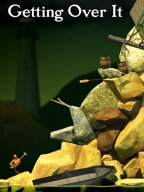</a>
<a href="games/The Bibleman The Video Game The Fight For The Faith">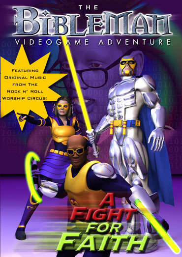</a>

<a href="games/Open Transport Tycoon Deluxe">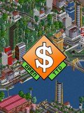</a>
<a href="games/Captain Novolin">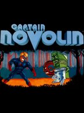</a>
<a href="games/Mindustry">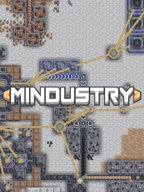</a>

<a href="games/Business Tour Online">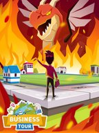</a>

<a href="games/Passpartout the Starving Artist">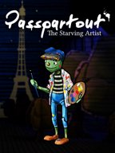</a>

<a href="games/Starbound">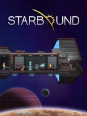</a>

<a href="games/Mud Runner">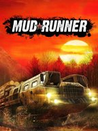</a>
<a href="games/The Stanley Parable">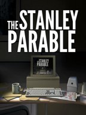</a>
<a href="games/We Need To Go Deeper">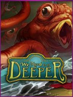</a>
<a href="games/Dwarf Fortress">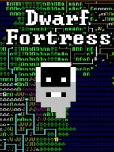</a>
<a href="games/Desert Bus">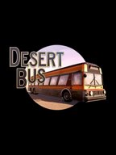</a>
<a href="games/The Binding of Isaac">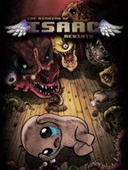</a>

<a href="games/Totally Reliable Delivery Service">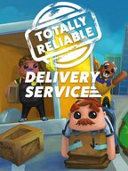</a>

<a href="games/Team Fortress 2">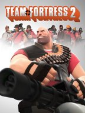</a>

<a href="games/Overcooked">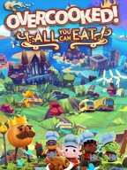</a>
<a href="games/Dome Romantik">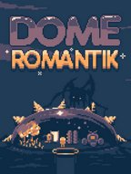</a>

<a href="games/[The Denpa Men 2">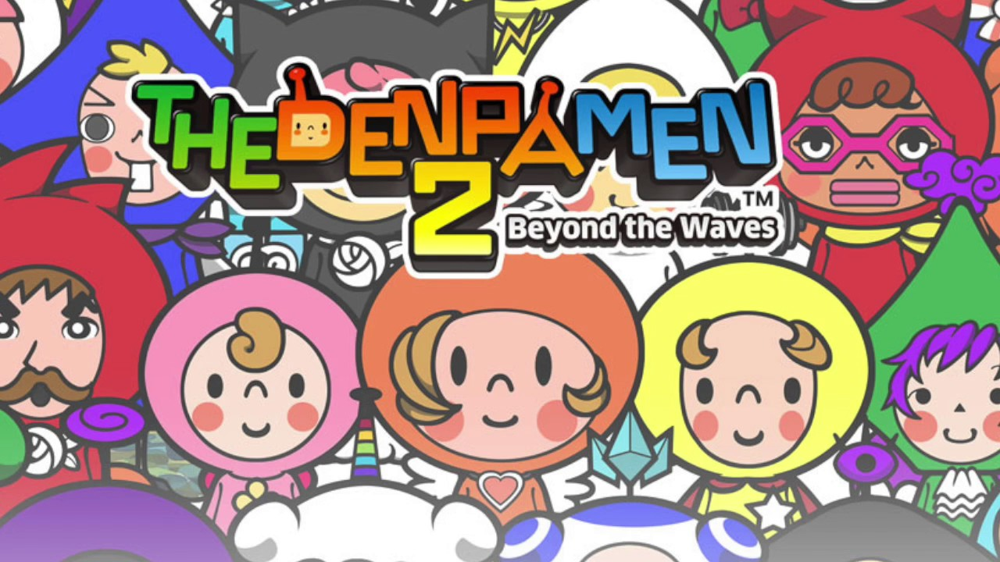</a>

<a href="games/Morshau RTX">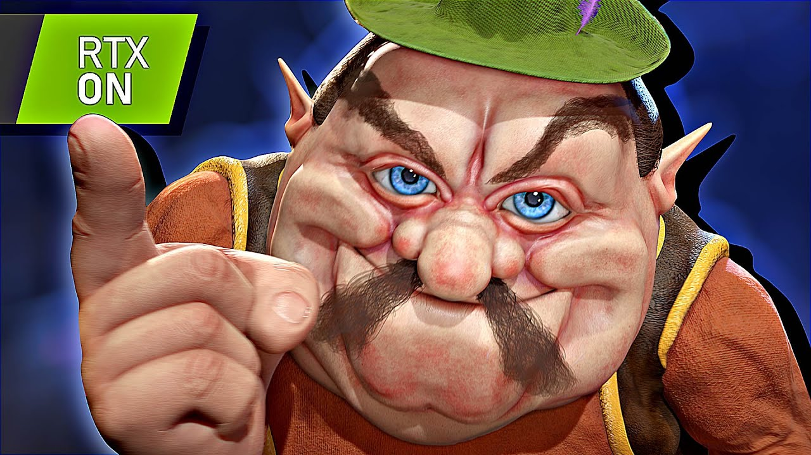</a>

<!-- # There is Work to be Done
As ever, there is demand for unpaid interns and willing volunteers. So go get to work.
[Technicians](technicians.md) tend to be inept, and management leaves things half-baked so ''[[Special:WantedPages|loads of stuff is probably missing]]'', make it exist and perhaps you will win some brownie points.
Occasionally, people try to better themselves by learning additional tongues. While it is deemed vulgar for our interns to demonstrate 'any' level of intellectual accomplishment, we're more than willing to take advantage of your over-accomplishment and force you to ''[[Special:WithoutInterwiki|translate some of our archives]]'' in hopes to spark foreign investor interest. [Scruby](scruby.md) will award you ''13 Scrubonus Points'' for each translation you provide.
Free thought from interns is generally pointless and rubbish, but if you are delusional enough to think you have a good idea, go dump it on the ''[https://Yet_Another_Community.fandom.com/f notice board]''. -->

